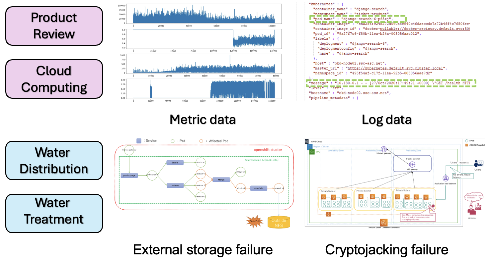

# [LEMMA-RCA](https://lemma-rca.github.io/)
Root cause analysis (RCA) is a task of identifying the underlying causes of system faults/failures by analyzing the system monitoring data. LEMMA-RCA is a collection of multi-modal datasets with various real system faults to facilitate future research in RCA. It is also a multi-domain dataset, encompassing real-world applications such as microservice and water treatment/distribution systems. The datasets are released under the CC BY-NC 4.0 license and hosted on Huggingface, the codes are available on Github.

<p align="center">
       
</p>

### Real System Faults
Each dataset contains various system faults simulated from real-world scenarios. 
For details, please check our [website](https://lemma-rca.github.io/).

### Multiple Domains and Dataset Download
LEMMA-RCA covers two domains and we provide both the raw data and preprocessed data. We release the dataset in [Huggingface](https://huggingface.co/Lemma-RCA-NEC) and the detailed data statistics can be found in [Lemma-RCA Webpage](https://lemma-rca.github.io/docs/data.html).  
- For the raw data version, we provide all json files where the microservice system stores both the metric data, the log data and even trace data. Users are expected to extract these two modalities by themself. The goal of the raw data is to provide the users more choice of preprocessing the raw data. 
- For the preprocessed data, we have extracted the metric data and unstructured log data for each pod. The users may use their own methods to preprocessed log data or use the provided code to preprocess the log data and convert it to time-series data. For instance, the code to preprocess the data in the IT domain is stored in the following directory.
  ```
   cd ./IT/data_preprocessing
  ```
  If you want to directly test the performance of these baseline methods, you may choose to download the preprocessed data.
- IT Operations (Product Review and Cloud Computing)
- OT Operations (Water Treatment/Distribution)
- Two Dataset Versions for Product Review: [[Raw Data](https://huggingface.co/datasets/Lemma-RCA-NEC/Product_Review_Original)][[Preprocessed Data](https://huggingface.co/datasets/Lemma-RCA-NEC/Product_Review_Preprocessed)]
- Two Dataset Versions for Cloud Computing: [[Raw Data](https://huggingface.co/datasets/Lemma-RCA-NEC/Cloud_Computing_Original)][[Preprocessed Data](https://huggingface.co/datasets/Lemma-RCA-NEC/Cloud_Computing_Preprocessed)]


### Unified Evaluation
LEMMA-RCA datasets are evaluated with eight causal learning baselines in four settings: online/offline with single/multiple modality data.

### Guideline for Evaluation 
Example: Using FastPC to evalute the Performance of Case 20211203 in Product Review

#### Step 1: Download the Case 20211203 of the [[preprocessed data from HuggingFace](https://huggingface.co/datasets/Lemma-RCA-NEC/Product_Review_Preprocessed/tree/main)].
You need to download both log and metric data if you would like to test the performance of FastPC on multi-modal data.

#### Notice: If you want to use metric data only, you can skip step 2 to step 5 and move directly to step 6 to detect root cause with metric data.

#### Step 2: Use the code in IT folder to preprocess the log data. 
```
cd ./IT/data_preprocessing
```

#### Step 3: Extract useful log information (such as pod/node names, log messages, etc.) from original elasticsearch log (json format) 
```terminal command
python json2message.py
```

***Notice***: Some of the arguments may need to change

```
    --path, the input directory of the json format log data
    --output_dir, the output directory of all log messages
    --output_dir2, the output directory of pod-level log messages for each pod
    --output_dir3, the output directory of node-level log messages for each node
```

#### Step 4: Usa Drain to parse both node-level and pod-level log messages

```terminal command
python drain3_parse.py ./output/log_prep_node/  -o "./drain3_result/node"

python drain3_parse.py ./output/log_prep_pod/   -o "./drain3_result/pod"

```

```
    --input_dir, default="./output/log_prep_node/" or "./output/log_prep_pod/"
    --output_dir, default="./drain3_result/node"   or "./drain3_result/pod"
  
```

#### Step 5: Log feature extraction

```terminal command
python log_frequency_extraction.py --log_dir ./input_path/  --output_dir ./output_path

python log_golden_frequency.py --root_path ./input_path/  --output_dir ./output_path --save_dir ./output_path
```

#### Step 6. Evalute the performance of FastPC on the Case 20211203 with metric data only:
- Notice that you need to change the path of data, dataset name and output directory. 
```
python test_FastPC_pod_metric.py  --dataset 20211203 --path_dir CHANGE_PATH_TO_DATASET_DIRECTORY --output_dir CHANGE_PATH_TO_OUTPUT_DIRECTORY
```
You may also test the performance of FastPC with log data or two modalities with the following command:
```
python test_FastPC_pod_log.py  ## for log data only
python test_FastPC_pod_combine.py  ## for both metric and log data
```

##### If you encounter the error regarding "name 'LIBSPOT' is not defined", please double-check if you are running the code in the directory of FastPC. We observe such an error if the command is 'python FastPC/test_FastPC_pod_log.py' running in the directory of './rca_baselines/Baseline/offline/'.
#### Step 7. Check the results
The results will be stored in the csv file as follows:
```
./Baseline/offline/output/Pod_level_combine_ranking.csv
```
The root cause for 20211203 (MongoDB-v1) can be found in the readme.pptx file in the folder of downloaded preprocessed data.


<!-- 
### File directory
```
Root:
      --|IT
            --|data preprocessing
                  --|json2message.py
                  --|drain3.py
                  --|drain3_parse.py
                  --|README.md
                  --|drain3.yaml
                  --|log_frequency_extraction.py
                  --|log_golden_frequency.py

      --|OT
            --|data preprocessing
                  --|SWaT
                        --|data_segment.py
                        --|node_data_cut.py
                        --|node_final_precess.py
                        --|pod_data_cut.py
                        --|pod_final_process.py
                        --|process.sh
                  --|WADI
                        --|data_segment.py
                        --|node_data_cut.py
                        --|node_final_precess.py
                        --|pod_data_cut.py
                        --|pod_final_process.py
                        --|process.sh
      --|Baseline
            --|offline
                  --|Dynotears
                  --|FastPC
                  --|GNN
                  --|GOLEM
                  --|LSTM
            --|online
                  --| baseline_final
``` -->
### Citation

If you use LEMMA-RCA in your work, please cite our paper:

Lecheng Zheng, Zhengzhang Chen, Dongjie Wang, Chengyuan Deng, Reon Matsuoka, and Haifeng Chen: LEMMA-RCA: A Large Multi-modal Multi-domain Dataset for Root Cause Analysis. CoRR abs/2406.05375 (2024)

### License

Creative Commons Attribution-NoDerivatives (CC BY-ND) 4.0 International License


